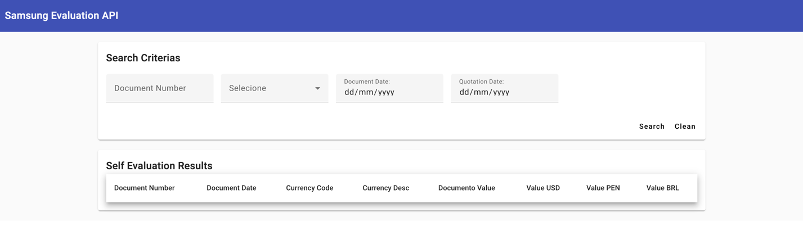
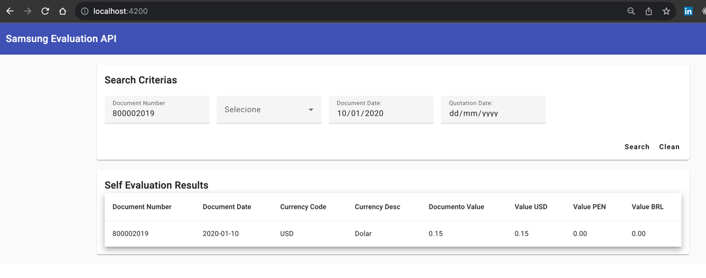
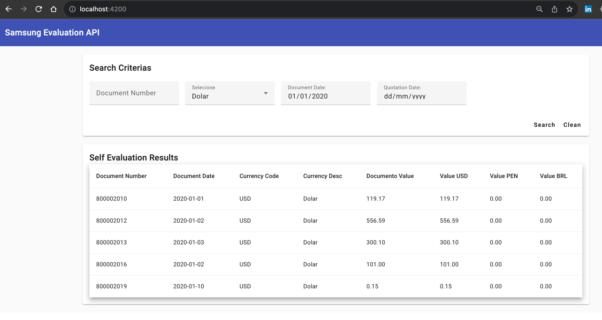
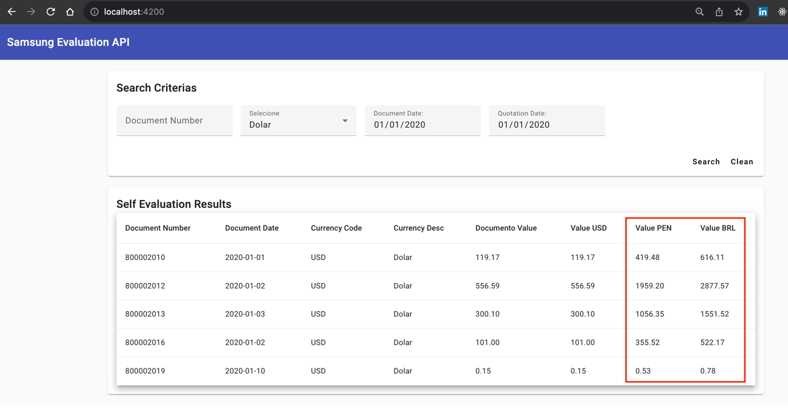

# Introdução

O Sistema consiste em buscar dados de APIs externas 
aonde o objetivo é exibí-los no frontend após todo tratamento
no backend.

Irei mostrar as funcionalidades desenvolvidas neste tutorial.

### Tela Principal

### Busca por "Document Number"

### Buscar por Tipo de Moeda

### Cáculo de Conversão de Moedas

# Backend

* Spring Boot
* Java 17
* Gradle

# Frontend

#### Instalando Angular

<code>npm install -g @angular/cli</code>

#### Criando projeto

<code>ng new samsung-evaluation-ui</code>
